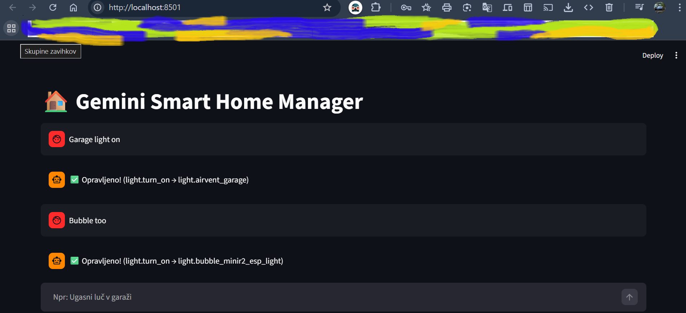

# 🏠 Gemini Smart Home Agent v5.0

A powerful, lightweight, and voice-enabled Smart Home Assistant powered by **Google Gemini 2.0 Flash**.
This Python application connects directly to your **Home Assistant** instance, allowing you to control your home using natural language (Voice or Text).



## 🚀 New in v5.0
- **🗣️ Natural Voice Output:** Uses Microsoft Edge TTS (Petra Neural) for high-quality Slovenian/English speech.
- **🌦️ Advanced Weather:** Reads 5-day forecasts directly from Home Assistant's `weather.get_forecasts` service.
- **🧠 Smart Context:** Understands slang (e.g., "Buben" = Bubble Light) and filters out system noise.
- **🎙️ Walkie-Talkie Mode:** Improved microphone handling for faster commands.

## 🛠️ Features
- **Control Devices:** Turn lights on/off, open blinds, lock doors.
- **Query State:** "Is the garage door open?", "What's the temperature in the living room?"
- **Future Cast:** "Will it rain tomorrow?" (Uses real forecast data).
- **Secure:** API keys are stored safely in `.streamlit/secrets.toml`.

---

## 📦 Installation & Setup

### 1. Prerequisites
- **Python 3.10** or newer installed on your computer.
- A **Home Assistant** instance (accessible via LAN IP like `192.168.x.x` or Nabu Casa URL).
- A **Google Gemini API Key** (Get it for free at [Google AI Studio](https://aistudio.google.com/)).

### 2. Clone the repository
Open your terminal (Command Prompt or PowerShell) and run:

```bash
git clone [https://github.com/MKtuzi/Gemini-Smart-Home-Agent.git](https://github.com/MKtuzi/Gemini-Smart-Home-Agent.git)
cd Gemini-Smart-Home-Agent
```


3. Install dependencies
Install the required Python libraries by running:

```bash
pip install -r requirements.txt
```

4. Configure Secrets (CRITICAL 🔐)
To keep your passwords safe, this app uses a specific file that is not shared on the internet.

Inside the Gemini-Smart-Home-Agent folder, create a new folder named .streamlit.

Inside that folder, create a new text file named secrets.toml.

File structure should look like this:

Plaintext
Gemini-Smart-Home-Agent/
├── .streamlit/
│   └── secrets.toml   <-- You create this file
├── app.py
├── requirements.txt
└── ...
Content of secrets.toml: Open the file with a text editor (like Notepad or VS Code) and paste this:

Ini, TOML
GEMINI_API_KEY = "YOUR_GOOGLE_API_KEY_HERE"
HA_TOKEN = "YOUR_LONG_LIVED_ACCESS_TOKEN_FROM_HA"
HA_URL = "[http://192.168.x.xx:8123](http://192.168.x.xx:8123)"

💡 How to get HA_TOKEN: Go to your Home Assistant Profile (click your icon at the bottom left) -> Scroll down to Long-Lived Access Tokens -> Click Create Token -> Name it "Gemini" -> Copy the long string.

5. Run the App 🚀
In your terminal, run:

Bash
streamlit run app.py
This will automatically open the app in your web browser.

⚙️ Customization
Open app.py in a code editor to tailor the agent to your home.

Change Language / Voice
Find the speak_text function in the code. Change "sl-SI-PetraNeural" to:

"en-US-AriaNeural" (English)

"de-DE-KatjaNeural" (German) (Any voice supported by Edge TTS)

Custom Aliases (Slang)
In the system_instruction variable (towards the bottom of the script), you can add your own rules so Gemini understands your specific nicknames.

Example inside the code:

Python
# Find this section inside system_instruction string:

"""
...
RULES:
1. If user says "Man Cave", they mean "light.basement_led".
2. If user says "Party Mode", activate "script.party_time".
...

"""
🤝 Contributing
Feel free to fork this project and submit pull requests!

Created by MKtuzi
